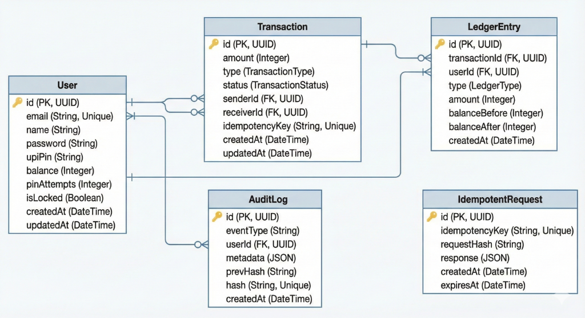

# 💰 Real-Time Transaction Audit System

A production-grade, real-time payment and transaction auditing system built with modern web technologies. This system implements secure money transfers, comprehensive audit trails, and real-time analytics for financial transactions.

---

## 📋 Table of Contents

- [Project Overview](#-project-overview)
- [Features](#-features)
- [Tech Stack](#-tech-stack)
- [Setup & Installation](#-setup--installation)
- [API Documentation](#-api-documentation)
- [Database Schema](#-database-schema)
- [AI Tool Usage Log](#-ai-tool-usage-log)
- [Project Structure](#-project-structure)
- [Security Features](#-security-features)

---

## 🎯 Project Overview

This project is a **Real-Time Transaction Audit System** designed to handle secure financial transactions with comprehensive auditing capabilities. The system implements industry-standard security practices including:

- **Double-Entry Ledger System**: Every transaction is recorded with both debit and credit entries, ensuring data integrity
- **Blockchain-Style Audit Trail**: Immutable, hash-chained audit logs for complete transaction transparency
- **UPI PIN Protection**: Secure 4-6 digit PIN verification for all money transfers
- **Idempotency**: Prevents duplicate transactions using unique idempotency keys
- **Real-Time Updates**: WebSocket-based notifications for instant transaction updates
- **Advanced Analytics**: Comprehensive statistics with daily, weekly, and monthly breakdowns

### Implementation Approach

The system follows a **microservices-inspired architecture** with clear separation between:

1. **Frontend (React + TypeScript)**: Modern, responsive UI with real-time updates
2. **Backend (Node.js + Express)**: RESTful API with robust authentication and authorization
3. **Database (PostgreSQL + Prisma ORM)**: Relational database with type-safe queries
4. **Real-time Layer (Socket.IO)**: WebSocket connections for live notifications

The implementation prioritizes **security**, **scalability**, and **data integrity** through:
- Bcrypt password hashing with configurable salt rounds
- JWT-based authentication with refresh tokens
- Rate limiting to prevent abuse
- Comprehensive error handling and logging
- Transaction atomicity using database transactions

---

## ✨ Features

### Core Functionality
- 🔐 **Secure Authentication**: Email/password authentication with JWT tokens
- 💸 **Money Transfers**: Real-time P2P transfers with UPI PIN verification
- 📊 **Transaction History**: Complete transaction history with filtering and pagination
- 👥 **User Search**: Find and send money to other users
- 💰 **Balance Management**: Real-time balance updates with ledger tracking
- 📈 **Analytics Dashboard**: Visual charts showing spending patterns and trends
- 🔔 **Real-time Notifications**: Instant notifications for all transactions

### Security Features
- ✅ Double-entry ledger system
- ✅ Blockchain-style audit logging with hash chaining
- ✅ Request idempotency to prevent duplicate transactions
- ✅ Rate limiting on authentication and transfer endpoints
- ✅ UPI PIN protection with attempt tracking
- ✅ Optimistic locking to prevent race conditions
- ✅ Comprehensive error handling and validation

### User Experience
- 📱 Mobile-friendly design
- 🔍 Advanced search and filtering
- 📊 Interactive charts and visualizations
- 💬 Chat-based transfer interface
- 📸 QR code scanning for quick transfers
- 👤 Random avatar generation for users

---

## 🛠️ Tech Stack

### Frontend
- **React 18** - UI framework
- **TypeScript** - Type-safe JavaScript
- **Vite** - Build tool and dev server
- **Recharts** - Data visualization
- **Lucide React** - Icon library
- **Socket.IO Client** - Real-time communication
- **React Router** - Client-side routing

### Backend
- **Node.js** - Runtime environment
- **Express.js** - Web framework
- **TypeScript** - Type-safe JavaScript
- **Prisma ORM** - Database toolkit
- **PostgreSQL** - Primary database
- **Socket.IO** - WebSocket server
- **JWT** - Authentication tokens
- **Bcrypt** - Password hashing
- **Winston** - Logging

### DevOps & Tools
- **Docker & Docker Compose** - Containerization
- **pgAdmin** - Database management
- **Git** - Version control
- **ESLint** - Code linting

---

## 🚀 Setup & Installation

### Prerequisites

Ensure you have the following installed on your Windows machine:

- **Node.js** (v18 or higher) - [Download](https://nodejs.org/)
- **Docker Desktop** - [Download](https://www.docker.com/products/docker-desktop/)
- **Git** - [Download](https://git-scm.com/downloads)

### Quick Start

For detailed setup instructions, please refer to **[SETUP.md](./[real-time-transaction-audit-system/SETUP.md](https://github.com/Tushararthava/real-time-transaction-audit-system/blob/main/SETUP.md))**.

**TL;DR - Quick Setup:**

```powershell
# 1. Clone and navigate to the project
git clone <your-repository-url>
cd real-time-transaction-audit-system

# 2. Run automated setup
.\setup.ps1

# 3. Generate and update JWT secrets in backend\.env
node -e "console.log(require('crypto').randomBytes(32).toString('hex'))"

# 4. Start backend (in terminal 1)
cd backend
npm run dev

# 5. Start frontend (in terminal 2)
cd fontend
npm run dev
```

**Live Demo:** [https://spectacular-respect-production.up.railway.app/](https://spectacular-respect-production.up.railway.app/)
**Access the application locally:** http://localhost:5173

**For complete setup instructions, troubleshooting, and manual installation steps, see [SETUP.md](./real-time-transaction-audit-system/SETUP.md)**

---

## 📚 API Documentation

Base URL: `http://localhost:5000/api`

### Authentication Endpoints

#### POST `/auth/signup`
Register a new user account.

**Request Body:**
```json
{
  "email": "user@example.com",
  "password": "SecurePassword123!",
  "name": "John Doe",
  "upiPin": "123456"
}
```

**Response:**
```json
{
  "success": true,
  "data": {
    "user": {
      "id": "uuid",
      "email": "user@example.com",
      "name": "John Doe"
    },
    "tokens": {
      "accessToken": "jwt-token",
      "refreshToken": "jwt-refresh-token"
    }
  }
}
```

#### POST `/auth/login`
Authenticate and receive JWT tokens.

**Request Body:**
```json
{
  "email": "user@example.com",
  "password": "SecurePassword123!"
}
```

**Response:**
```json
{
  "success": true,
  "data": {
    "user": {
      "id": "uuid",
      "email": "user@example.com",
      "name": "John Doe",
      "balance": 10000
    },
    "tokens": {
      "accessToken": "jwt-token",
      "refreshToken": "jwt-refresh-token"
    }
  }
}
```

#### POST `/auth/refresh`
Refresh expired access token.

**Request Body:**
```json
{
  "refreshToken": "jwt-refresh-token"
}
```

**Response:**
```json
{
  "success": true,
  "data": {
    "accessToken": "new-jwt-token"
  }
}
```

#### GET `/auth/me`
Get current user information.

**Headers:** `Authorization: Bearer <access-token>`

**Response:**
```json
{
  "success": true,
  "data": {
    "id": "uuid",
    "email": "user@example.com",
    "name": "John Doe",
    "balance": 10000,
    "createdAt": "2025-12-20T10:00:00Z"
  }
}
```

#### POST `/auth/logout`
Logout and invalidate tokens.

**Headers:** `Authorization: Bearer <access-token>`

### Transfer Endpoints

All transfer endpoints require authentication via `Authorization: Bearer <access-token>` header.

#### POST `/transfer/transfer`
Initiate a money transfer.

**Request Body:**
```json
{
  "receiverId": "receiver-user-id",
  "amount": 5000,
  "upiPin": "123456",
  "idempotencyKey": "unique-transaction-id"
}
```

**Response:**
```json
{
  "success": true,
  "data": {
    "transaction": {
      "id": "transaction-uuid",
      "amount": 5000,
      "status": "COMPLETED",
      "senderId": "sender-uuid",
      "receiverId": "receiver-uuid",
      "createdAt": "2025-12-20T10:00:00Z"
    },
    "newBalance": 5000
  }
}
```

#### GET `/transfer/transactions`
Get transaction history with optional filters.

**Query Parameters:**
- `type` (optional): `DEBIT` or `CREDIT`
- `status` (optional): `PENDING`, `COMPLETED`, or `FAILED`
- `limit` (optional): Number of results (default: 50)
- `offset` (optional): Pagination offset (default: 0)

**Response:**
```json
{
  "success": true,
  "data": {
    "transactions": [
      {
        "id": "uuid",
        "amount": 5000,
        "type": "DEBIT",
        "status": "COMPLETED",
        "receiver": {
          "id": "uuid",
          "name": "Jane Doe",
          "email": "jane@example.com"
        },
        "createdAt": "2025-12-20T10:00:00Z"
      }
    ],
    "total": 100,
    "limit": 50,
    "offset": 0
  }
}
```

#### GET `/transfer/balance`
Get current user balance.

**Response:**
```json
{
  "success": true,
  "data": {
    "balance": 10000
  }
}
```

#### GET `/transfer/users/search`
Search for users to send money to.

**Query Parameters:**
- `q`: Search query (email or name)

**Response:**
```json
{
  "success": true,
  "data": {
    "users": [
      {
        "id": "uuid",
        "name": "John Doe",
        "email": "john@example.com",
        "avatar": "avatar-url"
      }
    ]
  }
}
```

#### GET `/transfer/payees/recent`
Get list of recent payees.

**Response:**
```json
{
  "success": true,
  "data": {
    "payees": [
      {
        "id": "uuid",
        "name": "Jane Doe",
        "email": "jane@example.com",
        "avatar": "avatar-url",
        "lastTransactionDate": "2025-12-20T10:00:00Z"
      }
    ]
  }
}
```

### Statistics Endpoints

All statistics endpoints require authentication.

#### GET `/stats/summary`
Get summary statistics for the current user.

**Response:**
```json
{
  "success": true,
  "data": {
    "totalSent": 50000,
    "totalReceived": 75000,
    "totalTransactions": 125,
    "currentBalance": 25000
  }
}
```

#### GET `/stats/monthly`
Get 6-month transaction statistics.

**Response:**
```json
{
  "success": true,
  "data": {
    "monthlyStats": [
      {
        "month": "2025-12",
        "sent": 10000,
        "received": 15000,
        "count": 25
      }
    ]
  }
}
```

#### GET `/stats/weekly`
Get weekly transaction statistics.

**Response:**
```json
{
  "success": true,
  "data": {
    "weeklyStats": [
      {
        "week": "2025-W50",
        "sent": 5000,
        "received": 7500,
        "count": 10
      }
    ]
  }
}
```

#### GET `/stats/daily`
Get daily transaction statistics for the last 30 days.

**Response:**
```json
{
  "success": true,
  "data": {
    "dailyStats": [
      {
        "date": "2025-12-20",
        "sent": 1000,
        "received": 2000,
        "count": 5
      }
    ]
  }
}
```

### Error Responses

All endpoints follow a consistent error response format:

```json
{
  "success": false,
  "error": {
    "message": "Error description",
    "code": "ERROR_CODE",
    "details": {}
  }
}
```

Common HTTP status codes:
- `200` - Success
- `201` - Created
- `400` - Bad Request (validation errors)
- `401` - Unauthorized (invalid/missing token)
- `403` - Forbidden (insufficient permissions)
- `404` - Not Found
- `429` - Too Many Requests (rate limit exceeded)
- `500` - Internal Server Error

### Rate Limiting

- Authentication endpoints: 5 requests per 15 minutes per IP
- Transfer endpoints: 10 requests per minute per user
- Other endpoints: 100 requests per 15 minutes per user

---

## 🗄️ Database Schema

The system uses PostgreSQL with Prisma ORM. Below is the database schema:

### Entity Relationship Diagram



### Tables Description

#### User
Stores user account information and balance.

| Column         | Type      | Description                                |
|----------------|-----------|--------------------------------------------|
| id             | UUID      | Primary key                                |
| email          | String    | Unique user email                          |
| name           | String    | User's display name                        |
| password       | String    | Bcrypt hashed password                     |
| upiPin         | String    | Hashed 4-6 digit UPI PIN                   |
| balance        | Integer   | Current balance in cents (₹100 = 10000)   |
| pinAttempts    | Integer   | Failed PIN attempt counter                 |
| isLocked       | Boolean   | Account lock status                        |
| createdAt      | DateTime  | Account creation timestamp                 |
| updatedAt      | DateTime  | Last update timestamp                      |

**Indexes:** `email (unique)`, `userId`

#### Transaction
Stores all financial transactions.

| Column          | Type              | Description                          |
|-----------------|-------------------|--------------------------------------|
| id              | UUID              | Primary key                          |
| amount          | Integer           | Amount in cents                      |
| type            | TransactionType   | DEBIT or CREDIT                      |
| status          | TransactionStatus | PENDING, COMPLETED, or FAILED        |
| senderId        | UUID              | Foreign key to User (sender)         |
| receiverId      | UUID              | Foreign key to User (receiver)       |
| idempotencyKey  | String            | Unique key to prevent duplicates     |
| createdAt       | DateTime          | Transaction creation time            |
| updatedAt       | DateTime          | Last update time                     |

**Indexes:** `senderId + createdAt`, `receiverId + createdAt`, `idempotencyKey (unique)`

#### LedgerEntry
Double-entry bookkeeping for all transactions.

| Column         | Type       | Description                               |
|----------------|------------|-------------------------------------------|
| id             | UUID       | Primary key                               |
| transactionId  | UUID       | Foreign key to Transaction                |
| userId         | UUID       | Foreign key to User                       |
| type           | LedgerType | DEBIT or CREDIT                           |
| amount         | Integer    | Amount in cents                           |
| balanceBefore  | Integer    | Balance before transaction                |
| balanceAfter   | Integer    | Balance after transaction                 |
| createdAt      | DateTime   | Entry creation time                       |

**Indexes:** `userId + createdAt`, `transactionId`

#### AuditLog
Immutable audit trail with hash chaining (blockchain-inspired).

| Column    | Type     | Description                                    |
|-----------|----------|------------------------------------------------|
| id        | UUID     | Primary key                                    |
| eventType | String   | Event type (TRANSFER, LOGIN, SIGNUP, etc.)     |
| userId    | UUID     | Foreign key to User                            |
| metadata  | JSON     | Event-specific data                            |
| prevHash  | String   | Hash of previous audit entry (chain)           |
| hash      | String   | SHA-256 hash of this entry                     |
| createdAt | DateTime | Event timestamp                                |

**Indexes:** `createdAt`, `eventType`, `hash (unique)`

#### IdempotentRequest
Prevents duplicate requests using idempotency keys.

| Column         | Type     | Description                          |
|----------------|----------|--------------------------------------|
| id             | UUID     | Primary key                          |
| idempotencyKey | String   | Unique request identifier            |
| requestHash    | String   | Hash of request body                 |
| response       | JSON     | Cached response                      |
| createdAt      | DateTime | Request creation time                |
| expiresAt      | DateTime | Expiration time for auto-cleanup     |

**Indexes:** `idempotencyKey (unique)`, `expiresAt`

### Database Migrations

To run database migrations:

```powershell
cd backend
npx prisma migrate dev --name init
```

To view your database in a GUI:

```powershell
npx prisma studio
```

Or use pgAdmin at http://localhost:5051

---

## 🤖 AI Tool Usage Log

This project was developed with extensive assistance from multiple **AI-powered development tools** including **Google Gemini AI** (Gemini 2.0 Flash Experimental), **Claude AI**, and **GitHub Copilot** to accelerate development and improve code quality.

### AI-Assisted Tasks

| Task Category              | Specific Tasks                                                                                                      | Impact Level |
|----------------------------|---------------------------------------------------------------------------------------------------------------------|--------------|
| **Transaction Logic**      | • Wrote atomic transaction handling with Prisma transactions<br>• Implemented balance verification and updates<br>• Created ledger entry creation logic | Critical |
| **Type Safety**            | • Fixed TypeScript type errors across backend and frontend<br>• Created TypeScript interfaces and types for API contracts<br>• Resolved Prisma type compatibility issues | Medium |
| **Validation**             | • Created Zod schemas for all API request validation<br>• Implemented UPI PIN format validation<br>• Added email and password strength validation | Medium |
| **Testing & Debugging**    | • Debugged hash-related errors in UPI PIN verification<br>• Fixed implicit 'any' type errors in TypeScript<br>• Resolved database connection and migration issues | High |
| **Code Refactoring**       | • Refactored service layer to separate business logic<br>• Improved error messages and response formats<br>• Optimized database queries with selective field fetching | Medium |
| **Security Implementation**| • Generated rate limiting configurations<br>• Implemented CORS policies<br>• Added input sanitization and validation | High |
| **Documentation**          | • Created API documentation with request/response examples<br>• Generated database schema diagrams<br>• Wrote setup instructions for Windows environment | Medium |
| **DevOps Setup**           | • Created Docker Compose configuration<br>• Generated automated setup scripts (PowerShell and Batch)<br>• Configured environment variable templates | Medium |

### Specific AI Tool Contributions

**GitHub Copilot:**
- **Prisma ORM Setup**: Schema design, migrations, and database connection configuration
- **UPI PIN Protection**: Implemented PIN hashing, validation, and attempt tracking mechanisms
- **Transaction Security**: Secure transaction handling with atomic operations and balance verification

**Google Gemini AI:**
- Complex architectural decisions and system design
- Comprehensive API documentation generation
- Advanced debugging and error resolution

**Claude AI:**
- Detailed technical explanations and documentation
- Security implementation guidance

### Effectiveness Score: **4/5**

#### Justification:

**Strengths:**
- ✅ **Massive Time Savings**: Saved approximately **15-20 hours** on boilerplate code, schema design, and API endpoint creation
- ✅ **Reduced Errors**: AI-generated validation schemas and TypeScript types caught potential bugs early
- ✅ **Best Practices**: AI tools suggested industry-standard patterns for authentication, ledger systems, and audit logging
- ✅ **Quick Prototyping**: Rapidly generated UI components and layouts, allowing focus on business logic
- ✅ **Documentation**: Automatically generated comprehensive API docs and setup guides
- ✅ **Problem Solving**: Excellent at debugging complex TypeScript type errors and Prisma query issues
- ✅ **Multiple Perspectives**: Using Gemini, Claude, and Copilot provided diverse approaches to problem-solving

**Areas for Improvement:**
- ⚠️ **Context Limitations**: Sometimes needed multiple iterations to get complex logic right (e.g., double-entry ledger)
- ⚠️ **Debugging AI Code**: Spent ~2-3 hours debugging AI-generated bcrypt hashing issues in UPI PIN verification
- ⚠️ **Over-Engineering**: Initial suggestions were sometimes too complex; needed simplification for MVP
- ⚠️ **Consistency**: Required manual review to ensure consistent code style across different AI tool outputs

---

## 🔒 Security Features

### Authentication & Authorization
- **JWT-based authentication** with access and refresh tokens
- **Secure password hashing** using bcrypt with configurable salt rounds
- **UPI PIN protection** with attempt tracking and account locking
- **Token expiration** (15 minutes for access, 7 days for refresh)

### Transaction Security
- **Idempotency keys** to prevent duplicate transactions
- **Optimistic locking** to prevent race conditions
- **Atomic database transactions** ensuring data consistency
- **Balance verification** before every transfer
- **Double-entry ledger** for accounting integrity

### Audit & Compliance
- **Immutable audit logs** with blockchain-style hash chaining
- **Complete transaction history** with timestamps
- **Event logging** for all critical operations
- **Request logging** with Winston

### Rate Limiting
- Authentication endpoints: 5 requests per 15 minutes
- Transfer endpoints: 10 requests per minute
- General endpoints: 100 requests per 15 minutes

### Data Protection
- **Environment variable validation** on startup
- **Input sanitization** and validation using Zod
- **CORS configuration** restricting frontend origins
- **SQL injection prevention** via Prisma ORM parameterized queries

---

**Made using React, Node.js, and PostgreSQL**
